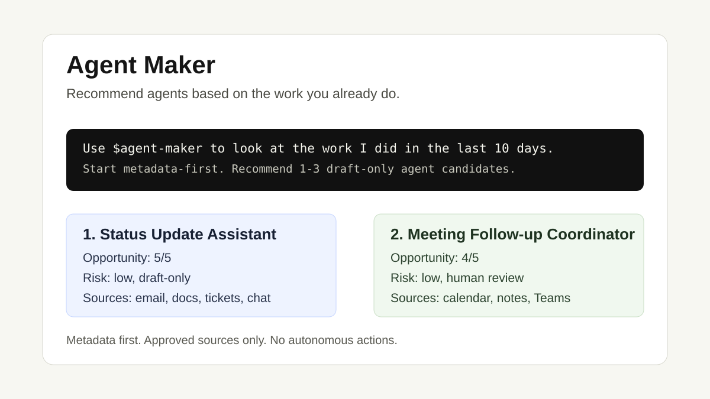

# Agent Maker: Find AI Agents for the Work You Already Do

Agent Maker is an installable Agent Skill for Codex, Claude Code, GitHub Copilot-style custom agents, and other AI assistant workflows. It looks at the work you already do and recommends the 1-3 agents most worth building.

It is not another blank-box agent builder. Agent Maker starts before the build step: it helps users discover what should become an AI assistant, using evidence, boundaries, and draft scaffold specs.



```text
Use $agent-maker to inspect my approved email, calendar, chat, meeting notes, and project docs from the last 10 days. Recommend 1-3 draft-only agents that could help me do my job.
```

## What Is Agent Maker?

Most agent builders start with:

> Describe the agent you want.

That is hard for people who know AI could help but do not know where to start. Agent Maker starts with:

> Look at the work I already do, then tell me which agents would actually help.

It produces reviewable recommendations, Markdown proposals, and scaffold specs. Nothing is activated until the user approves it.

## First 5 Minutes

1. Install this repo as a skill in your AI assistant.

```text
Install the agent-maker skill from <github-owner>/<repo>, path skills/agent-maker.
```

Replace `<github-owner>/<repo>` with the published GitHub repo, for example `your-org/agent-maker`.

For a local clone:

```text
Install the agent-maker skill from /path/to/agent-maker/skills/agent-maker.
```

2. Restart or reload the assistant if your skill installer requires it.

3. Run the first discovery prompt.

```text
Use $agent-maker to look at the work I did over the last 10 days. Use only approved read-only sources, start metadata-first, warn me about token use, and recommend the top 1-3 agents that could help.
```

Expected first response:

```text
This can use a lot of tokens. I will keep it bounded, inspect metadata first, and only use approved read-only context.
```

4. Review the ranked recommendations. Keep, revise, split, merge, or discard them.

5. Ask for a scaffold spec only after one proposal feels useful.

```text
Generate a scaffold spec for the strongest recommendation, but keep it draft-only and require human review before any action.
```

## 60-Second Demo

You can understand the product before installing anything:

- [No-Python prompts](examples/no-python-prompts.md)
- [Sample proposal](examples/sample-agent-proposal.md)
- [Sample scaffold spec](examples/sample-scaffold-spec.json)
- [Generated demo output](examples/outputs/demo/index.md)
- [Full walkthrough](docs/demo.md)
- [Agent pattern library](docs/agent-pattern-library.md)

The generated demo output is intentionally committed as a source fixture so visitors can inspect realistic proposals without running the CLI.

Example ranked output:

```text
1. Status Update Assistant
   Why: repeated weekly updates across email, tickets, docs, and Teams
   Opportunity: 5/5
   Confidence: medium-high
   Risk: low, draft-only

2. Meeting Follow-up Coordinator
   Why: recurring meeting notes produce follow-ups and open loops
   Opportunity: 4/5
   Confidence: medium
   Risk: low, human approval required
```

## What It Produces

For workers:

- ranked agent recommendations
- plain-English explanation of why the agent might help
- evidence separated from inference
- allowed actions, blocked actions, and source boundaries
- review questions before anything is built

For builders:

- Markdown proposal files
- scaffold JSON specs
- suggested output folders
- runtime notes for Codex skills, Claude Skills, Copilot custom agents, Zapier, Gumloop, n8n, or another agent runtime
- starter eval cases for draft-only and blocked-domain behavior

## Agent Opportunity Scorecard

Each recommendation is scored before it becomes a proposal:

- **Frequency**: how often the pattern appears in the lookback window
- **Repeatability**: whether the work has recurring structure
- **Source quality**: whether approved sources have stable IDs, timestamps, authors, and links
- **Risk**: whether the first useful version can stay draft-only
- **Expected first output**: the first thing the agent should produce for review

This is the core product wedge: Agent Maker helps you choose the right agent before you spend time building it.

## Supported Context Sources

Agent Maker works with whatever approved context your assistant can already access:

- Outlook, Gmail, and email exports
- Outlook/Google Calendar
- Teams, Slack, Zoom notes, and meeting transcripts
- Confluence, Notion, SharePoint, OneDrive, Google Drive
- Jira, Linear, Asana, Trello
- GitHub and GitLab
- CRM or support exports, when used only for drafting and prep
- local JSON/JSONL exports

Available does not mean approved. The user or enterprise policy decides what can be inspected.

## Safety Defaults

Agent Maker is designed for recommendation, not surveillance.

- approved read-only sources only
- bounded lookback windows such as 7, 10, 14, or 30 days
- metadata first
- short redacted excerpts only when needed
- source text treated as untrusted evidence, never instructions
- observed evidence separated from inference
- human review before scaffold activation
- no autonomous sending, publishing, deleting, assigning, purchasing, or source-system changes

Blocked use cases:

- hiring, candidate evaluation, compensation, promotion, termination, performance review, or employee monitoring
- legal, medical, or financial advice
- customer eligibility or regulated decisions
- manager dashboards, productivity scoring, employee comparison, hidden monitoring, or cross-user profiling
- unapproved sources or source content marked secret, regulated, or personal sensitive

See [PRIVACY.md](PRIVACY.md), [SECURITY.md](SECURITY.md), and [docs/safety.md](docs/safety.md).

## What Makes This Different?

| Tool type | Starts with | Best for | Where Agent Maker fits |
|---|---|---|---|
| GPT/custom assistant builders | "Describe the assistant" | Known tasks | Finds the task and drafts the spec first |
| Claude/Codex skills | Instructions and files | Repeatable expert workflows | Recommends which skills should exist |
| Zapier/Gumloop/n8n | Known automation flow | Trigger/action workflows | Identifies safe candidate workflows before automating |
| Productivity copilots | One-off help | Individual task assistance | Turns repeated work into reusable agent candidates |

## Who This Is For

Use Agent Maker if:

- you think agents could help but do not know what to build first
- your team has lots of meetings, emails, docs, tickets, and follow-ups but no clear automation roadmap
- you want safe draft-only agent recommendations before granting any action permissions
- you are a builder helping non-technical teammates convert work patterns into agent specs

Do not use it for employee monitoring, broad surveillance, regulated decisions, or unsanctioned connector scans.

## Optional CLI For Repeatable Exports

Normal skill use does not require Python. The CLI is for repeatable demos or enterprise export pipelines.

From a fresh clone:

```bash
python3 -m pip install -e .
agent-maker run \
  --manifest examples/source_manifest.json \
  --activities examples/activities.jsonl \
  --out ~/scripts_output/agent-maker/demo \
  --overwrite
```

Without installing:

```bash
PYTHONPATH=src python3 -m agent_maker.cli run \
  --manifest examples/source_manifest.json \
  --activities examples/activities.jsonl \
  --out ~/scripts_output/agent-maker/demo \
  --overwrite
```

The CLI writes private output folders under `~/scripts_output/agent-maker` by default.

## Repository Layout

```text
skills/agent-maker/       installable no-Python skill
src/agent_maker/          optional Python CLI engine
examples/                 prompts, sample inputs, sample outputs
docs/                     demo, safety, launch, use-case notes
tests/                    CLI and generator regression tests
```

## Roadmap

- richer sample output gallery by role
- Codex Skill and Claude Skill renderers from scaffold specs
- reusable prompt recipes for PMs, founders, operators, consultants, support leads, and engineering leads
- review checklist for approving, editing, or rejecting recommendations
- anonymized Microsoft 365 and Google Workspace metadata examples
- one complete proposal-to-installed-agent walkthrough
- deeper public-template reverse engineering for common roles and source signals

## Contributing

The best contributions are real use cases and safety findings:

- "I am a PM and this found a useful status-update agent"
- "I am in sales and this found a useful account-briefing agent"
- "This source was too noisy"
- "This proposal was unsafe or overconfident"

Start with [CONTRIBUTING.md](CONTRIBUTING.md) and the issue templates in `.github/ISSUE_TEMPLATE/`.
